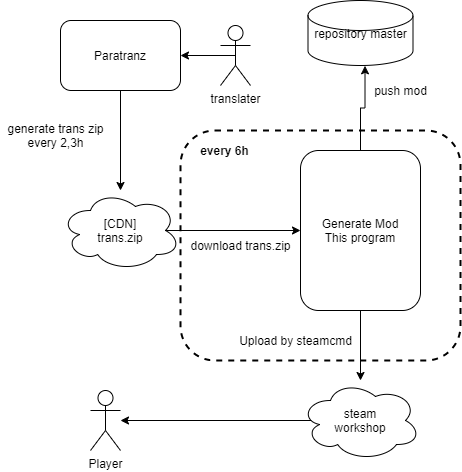

# Japanese language mod for Crusader Kings III

This is a Japanese localization mod for Crusader Kings III.

## Publish Flow

## Mod tree

See source folder in reoisitory.

- localization
- descriptor.mod
- title.jpg
  - english
    - C:\Program Files (x86)\Steam\steamapps\common\Crusader Kings III\game\localization\english
  - replace
    - clausewitz
      - C:\Program Files (x86)\Steam\steamapps\common\Crusader Kings III\clausewitz\localization
    - jomimi
      - C:\Program Files (x86)\Steam\steamapps\common\Crusader Kings III\jomini\localization
  
## Steam workshop

https://steamcommunity.com/sharedfiles/filedetails/?l=japanese&id=2217567218

## Translation workspace

https://paratranz.cn/projects/1518

## Translation community (Discord channel)

https://discord.gg/Cu7zE5X

## Game wiki

http://ck3.paradwiki.org

## Paradox Ironman mode
No support

## File size

6MB

## Auto update

Yes: Every 6h (UTC)

## Github actions secrets

| name | description |
|:---:|:---:|
| AWS_S3_ACCESS_KEY | Amazon Web Service IAM access key. IAM must have a S3 write access authority|
| AWS_S3_SECRET_ACCESS_KEY | Amazon Web Service IAM secret key|
| PARATRANZ_SECRET | Your paratranz personal secret.|
| STEAM_LOGIN_NAME | Your steam login name. You must have a target game.|
| STEAM_LOGIN_PASSWORD | Your steam login password.|
