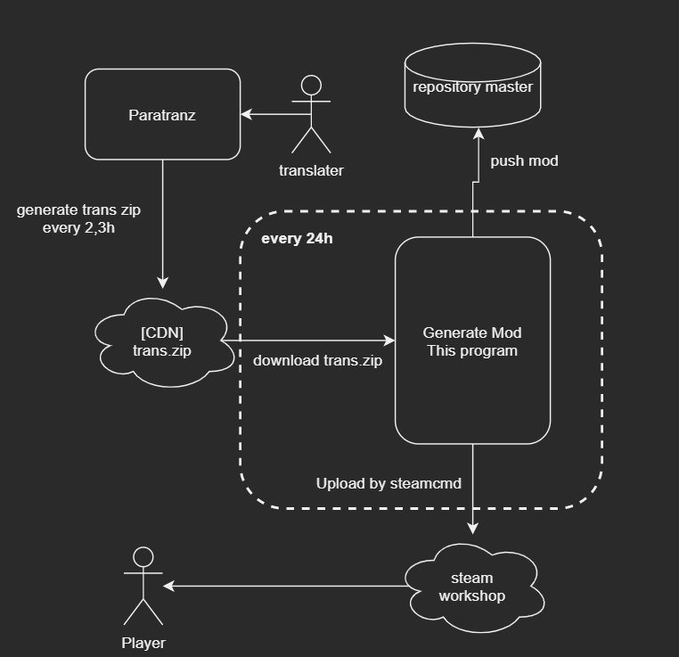

# Japanese language mod for Crusader Kings III

This is a Japanese localization mod for Crusader Kings III.

## Publish Flow

## Mod tree

See source folder in reoisitory.

- localization
- descriptor.mod
- title.jpg
  - english
    - C:\Program Files (x86)\Steam\steamapps\common\Crusader Kings III\game\localization\english
  - replace
    - clausewitz
      - C:\Program Files (x86)\Steam\steamapps\common\Crusader Kings III\clausewitz\localization
    - jomimi
      - C:\Program Files (x86)\Steam\steamapps\common\Crusader Kings III\jomini\localization
    - game
      - special localized entries for japanese
  
## Steam workshop

https://steamcommunity.com/sharedfiles/filedetails/?l=japanese&id=2217567218

## Translation workspace

https://paratranz.cn/projects/1518

## Translation community (Discord channel)

https://discord.gg/Cu7zE5X

## Game wiki for Japanese

https://ck3wiki.popush.cloud/

## Paradox Ironman mode
No support

## File size

7MB

## Auto update

Yes: Every 3days (UTC00:00 JST9:00)

## Manual release

Only collaborators

## How to use auto update program for other project ?

### Github actions secrets

You need to set following credentials to github actions.

| name | description |
|:---:|:---:|
| PARATRANZ_SECRET | Your paratranz personal secret.|
| STEAM_LOGIN_NAME | Your steam account name. You must have a target game.|
| STEAM_LOGIN_PASSWORD | Your steam account password.|

#### How to get Paratranz secret ?

1. Go to user page from user portrait(upper right).
2. Click key icon 

### Steam cmd secret files

You need to prepare Steam cmd secret(ssfnXXXXXXXX).

#### How to get Steam CMD secrets? 

1. [Download](https://steamcdn-a.akamaihd.net/client/installer/steamcmd.zip) SteamCmd and unpack download zip
2. Run steamcmd using your steam account name and password
3. Steamcmd generates ssfn files on working directory

## References

 - [SteamCmd](https://developer.valvesoftware.com/wiki/SteamCMD)
 - [Upload mods using steamcmd](https://partner.steamgames.com/doc/sdk/uploading)
